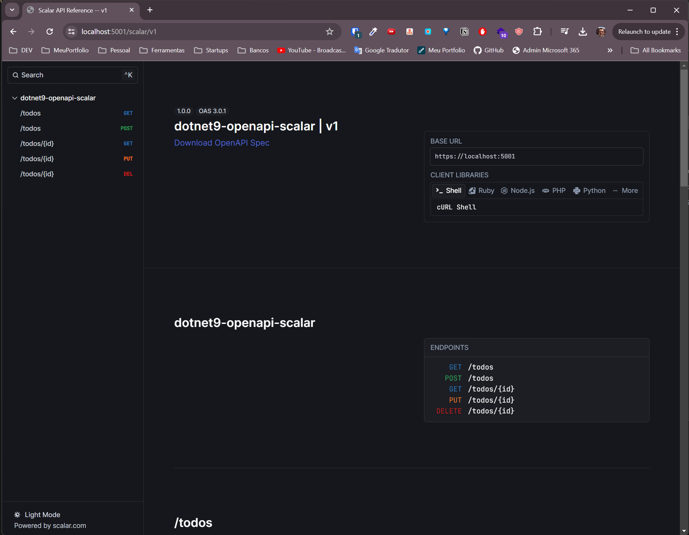
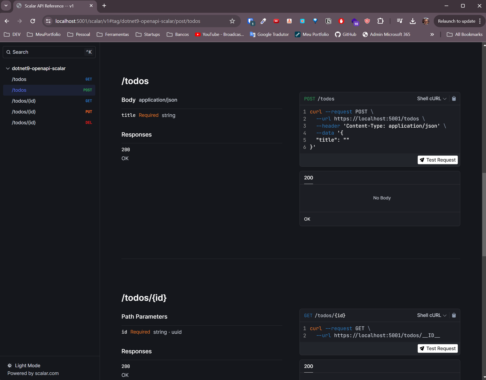
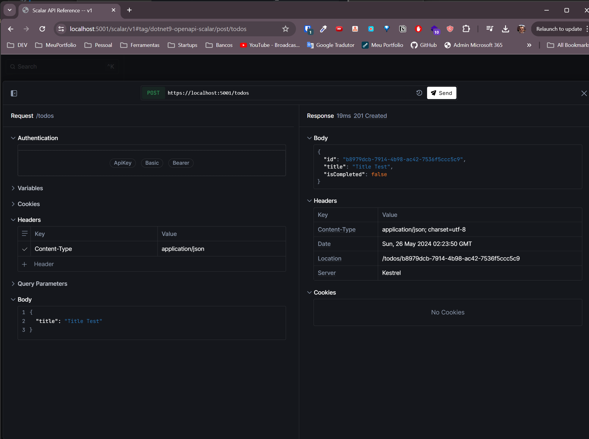
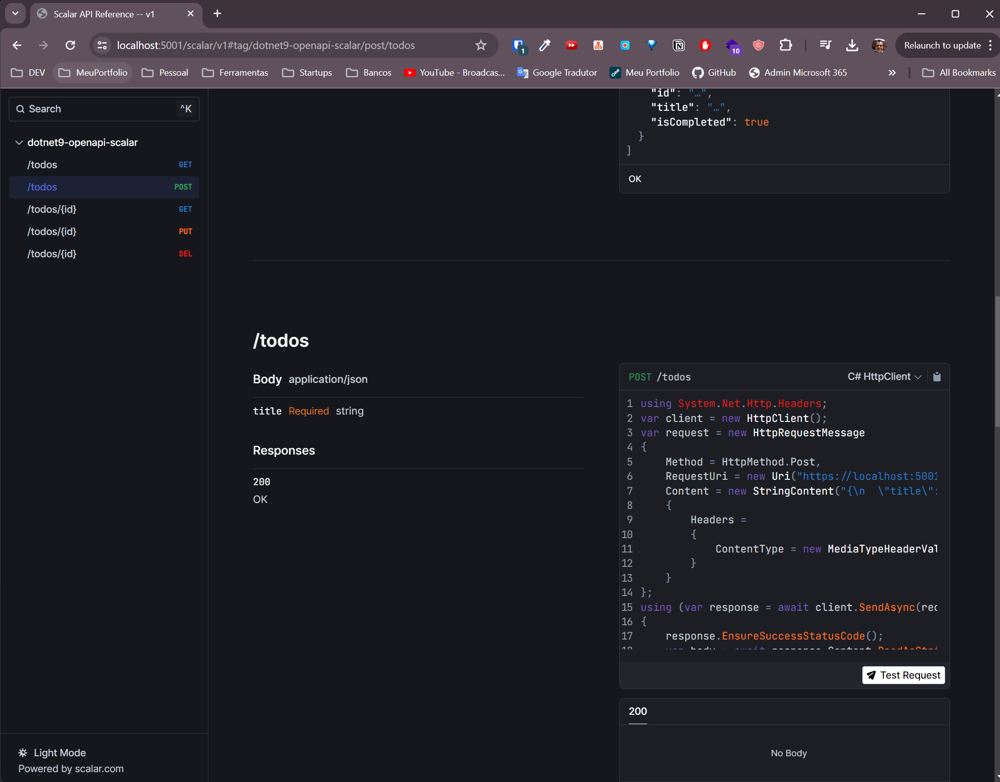

# dotnet9-openapi-scalar
This project, named dotnet9-openapi-scalar, was created to learn how to implement a presentation layer using Scalar directly in .NET (version 9 preview) with OpenAPI (Microsoft.AspNetCore.OpenApi) and Scalar.AspNetCore.

## Overview
The project demonstrates a simple Todo API built with .NET 9 preview and integrates Scalar for the presentation layer. The API includes basic CRUD operations for managing Todo items.

## Features
* Endpoints:
    * GET /todos: Retrieve all todos.
    * GET /todos/{id}: Retrieve a specific todo by ID.
    * POST /todos: Create a new todo.
    * PUT /todos/{id}: Update an existing todo.
    * DELETE /todos/{id}: Delete a todo.

* Technologies:
    * [.NET 9 (preview)](https://dotnet.microsoft.com/en-us/download/dotnet/9.0)
    * [Scalar](https://www.scalar.com)
    * [OpenAPI](https://www.openapis.org/)    

## Setup and Running the Project

### Prerequisites
* [.NET 9 SDK](https://dotnet.microsoft.com/en-us/download/dotnet/9.0)
* [Visual Studio Preview](https://visualstudio.microsoft.com/vs/preview/)

### Steps
1. Clone the repository:

```
git clone https://github.com/yourusername/dotnet9-openapi-scalar.git
cd dotnet9-openapi-scalar
```

2. Build the project:

```
dotnet build
```

3. Run the project:

```
dotnet run
```

4. Access the Scalar UI:
The Scalar UI will be accessible at https://localhost:5001/scalar/v1.

## Testing
The project includes a set of tests to validate the functionality of the API. Additionally, there is a .http file with example requests to reference.

## Running Tests
1. Navigate to the tests directory:

```
cd tests
```

2. Run the tests:

```
dotnet test
```

## .http File
The .http file contains various HTTP requests to test the API endpoints. You can use tools like Visual Studio Code's REST Client extension to run these requests.

## Screenshots

### Screenshot 1: Scalar UI


### Screenshot 2: POST Request


### Screenshot 3: POST Request Detail


### Screenshot 4: POST Request language execution


You can reach me on [LinkedIn](https://www.linkedin.com/in/felipebossolani).